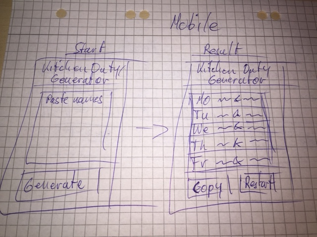
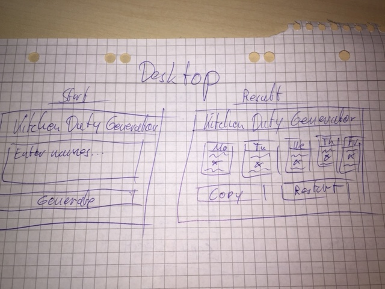

## Project Log

Project: Design the frontend for a random daily task assignment over the span of one week.

---

### Planning
- Set up todo/tasks 0.5
- Time estimate 0.25
- Decide on supported devices 0.25
- Set up file structure 0.5
- Scribble wireframes/layout 1
- Source materials 0.5
- Feedback/Communication 1
---
~ 4hrs

---

### Execution
- Realize first mockup to check layout structure 8
- Browser testing 4
- Detailed layout and finishing 8
- Git version control 4
---
~ 24hrs

---

### Time estimate
28 hours over five days

---

### Wireframes/Scribbles

